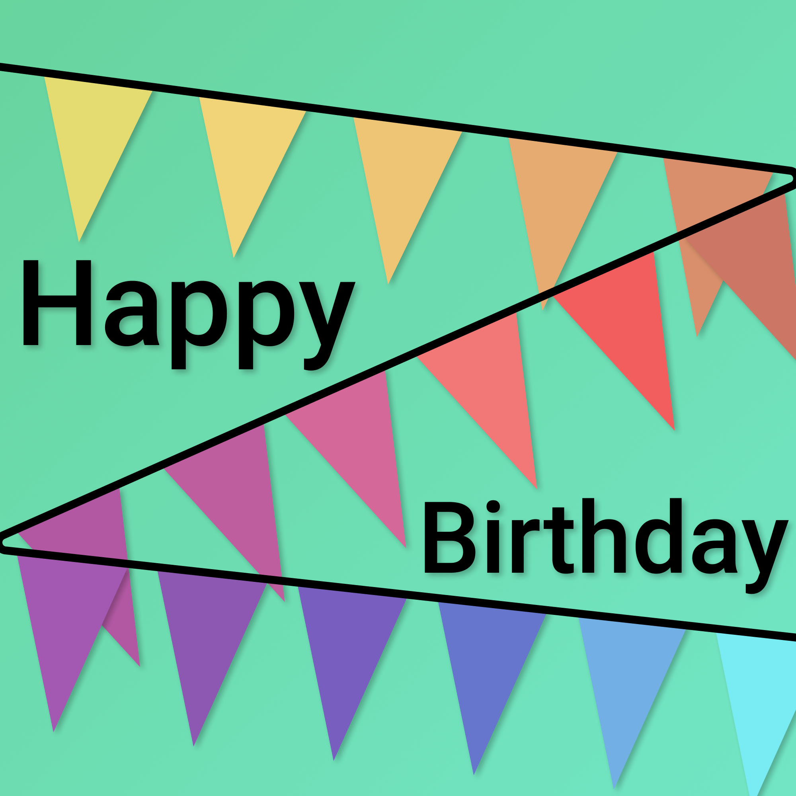

# Testing page

## Getting Super Powers

Becoming a super hero is a fairly straight forward process:

```
$ give me super-powers
```


 Super-powers are granted randomly so please submit an issue if you're not happy with yours.


Once you're strong enough, save the world:


```bash
# Ain't no code for that yet, sorry
echo 'You got to trust me on this, I saved the world'
```




this



Get all the packs for a user






Your randomly assigned user ID










```

```







tab



another tab  




info



warn



success


| title 1 | title 2 |
| :--- | :--- |
| content 1 | content 2 |
| content 1 lower | content 2 lower |
|  |  |
| another thing |  |
|  |  |

> quote

```bash
code
block
```

$$
maths*equation=strange
$$

* bullet 
* point
* list

1. ordered
2. list

* [ ] task
* [ ] list
* [x] completed
























You can never delete the all-seeing Minion


```
Minion cannot be deleted
```




You are not allowed to delete the all-seeing Minion


```
Minion cannot be deleted
```




Minion is too powerful for the server


```
Minion cannot be deleted
```





